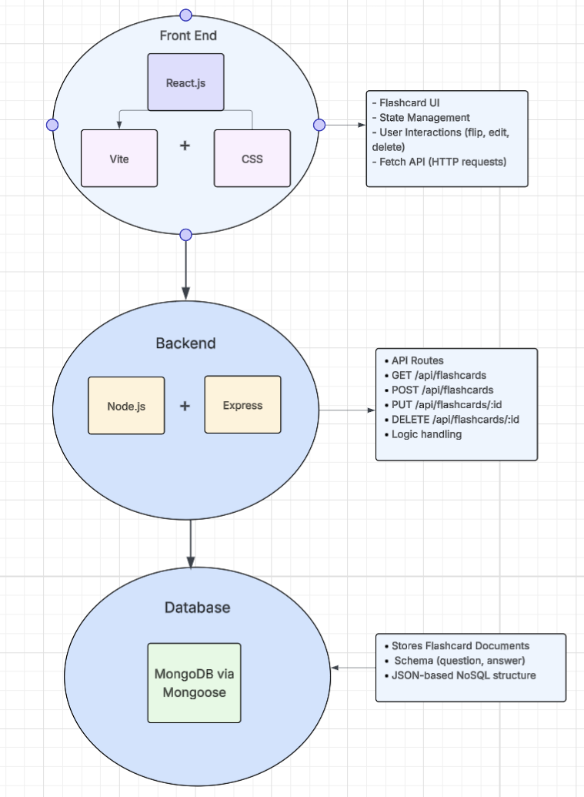

My Flashcard-Project

This project is a creative answer to the common student's organisation and time management issues. When studying for exams and content heavy subjects that require both memorisation and interpretation of information, the best way to prepare is active recall. 

This webapp allows users to input questions and answers to their personal flashcard stack and start studying straight away. Instead of hand cutting cards and writing every question and its answer, this app allows users to save time and get straight to studying, providing ability to change and add more cards to their match their needs.

3) an illustration of the technical stack, including frontend, styling, routing, data, and deployment (if applicable). 

For the tech stack I've chosen to use React paired with Vite and CSS  for frontend and Node.js and Express for backend API calls aswell as logic handling. The database is MongoDB and Mongoose for connection.

4) Feature List: 
- Flashcard creation with question and answer input
- Real-time display of flashcards from the database
- Edit existing flashcards (update functionality)
- Delete flashcards permanently from the database
- Interactive card flip animation to reveal answers
- Disapearring cards after answer is revealed
- Fade-out animation when cards are completed
- Reset study session to restore all flashcards
- Responsive grid layout for displaying flashcards
- Hover effects and 3D tilt for improved user interaction
- Form validation to prevent empty submissions
- Asynchronous data fetching using REST API
- Persistent data storage using MongoDB
- Full CRUD functionality (Create, Read, Update, Delete)
- Single-page application behavior

5) Briefly explain the folder structure. 

This project is split into to two main folders
    Client - for frontend react application
    Server - for backend files and database connections

In client there is the src in which contains the main source code and its styling
- App.jsx
- Main.jsx
- Index.css

In server the main files are backend dependencies and server.js which runs the express server and the API routes

6) A summary of challenges overcome

I faced challenges mainly with feature logic contradictions, especially when the inital draft didn't include flipping logic which then had to be refactored in to most of the functions. I also had to differentiate between deleting cards from database and hiding cards after use. Styling and css details also was time consuming and involved refactoring most of the strucutre of the app.jsx to sort out the div and class arrangements. I also had some trouble with github, some commits were stashed and I tried to commit them into a new branch which caused a small crash, I was able to save the stashed changes and push them into development and save those features. Overall the main challenges were refactoring everytime I had a big Ui change and making sure that my changes didnt break and go into conflict with others when triggered.
